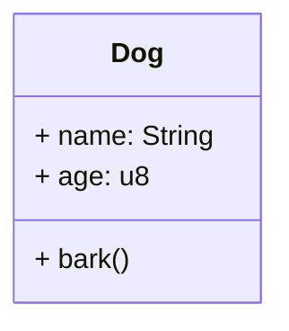
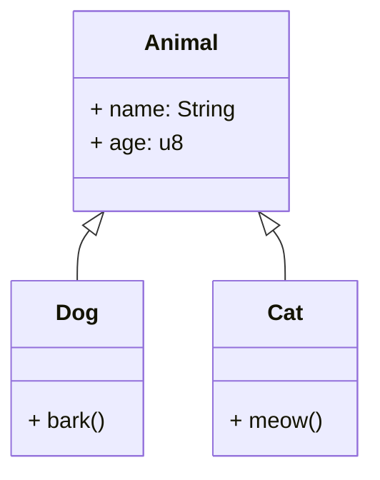
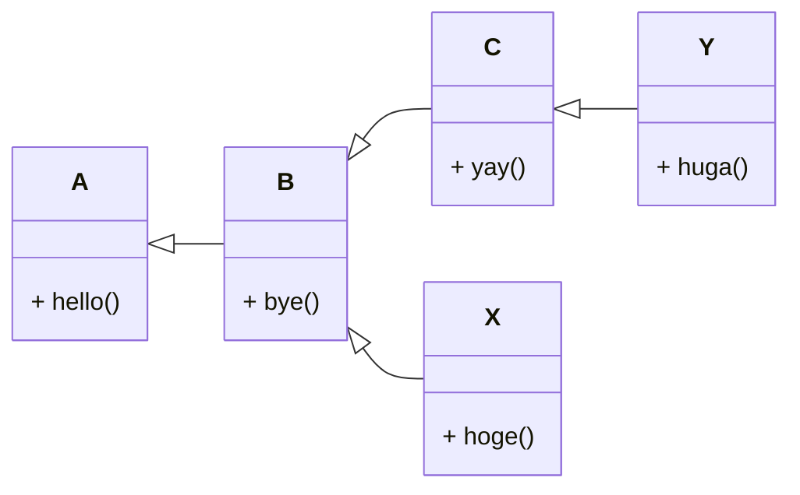
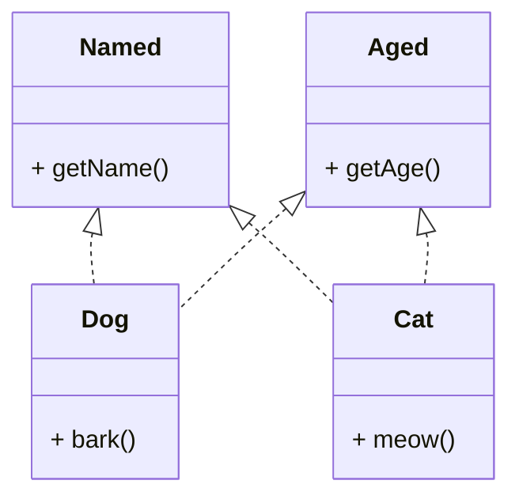
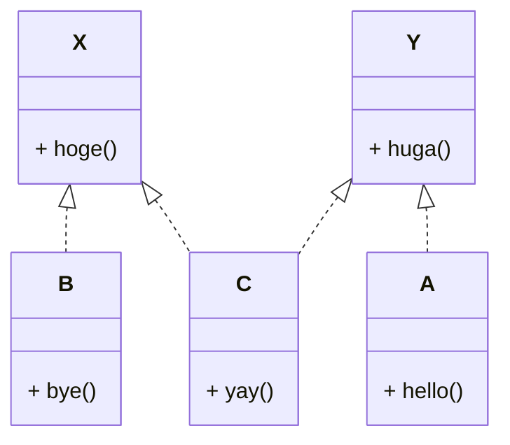

# いつRustを選択するべきか

学習コストが高いRustをなぜ利用するのでしょうか？

<div class="absolute bottom-10">Ama / Yuki Okugawa</div>

---
layout: image-right
image: "/me.jpg"
---

# 自己紹介 Ama

- 和歌山県立医科大学<br>医学部4年
- PG歴: 2年目(23年2月~)
- Backend (統括)
- 好きなもの: Neovim
- 最近: BEコース以外も<br>　やりたい

---
layout: section
---

# この発表の目的

---
layout: bullets
---

# What is Rust?

<v-clicks>

- パフォーマンス
- 安全性
- 開発体験

</v-clicks>

---
layout: statement
---

# 先進的概念の積極導入

<v-click>

Rustは陶酔する人がとても多い

</v-click>

---
layout: iframe
url: https://survey.stackoverflow.co/2022#section-most-loved-dreaded-and-wanted-programming-scripting-and-markup-languages
---

---
layout: image
image: "/misskey-rust-tweet.png"
---

---
layout: bullets
---

# この発表の目標

<v-clicks>

- 世の中にある**様々な言語機能**を知る。
- Rust を**学習する意義**は？
- Rust の**使いどころ**は？

</v-clicks>

---
layout: section
---

# Rustが便利と思える瞬間

---
layout: image-right
transition: fade
image: "/math2img.png"
---

# Rustで作れるもの

- **コマンドラインツール**
- Web系
    - サーバーサイド
    - フロントエンド
- DSL

---
layout: iframe-right
transition: fade
url: https://docs.rs/axum/latest/axum/
---

# Rustで作れるもの

- コマンドラインツール
- Web系
    - **サーバーサイド**
    - フロントエンド
- DSL

---
layout: iframe-right
transition: fade
url: https://leptos.dev
---

# Rustで作れるもの

- コマンドラインツール
- Web系
    - サーバーサイド
    - **フロントエンド**
- DSL

---
layout: image-right
transition: fade
image: "/amabot.png"
---

# Rustで作れるもの

- コマンドラインツール
- Web系
    - サーバーサイド
    - フロントエンド
- **DSL**

---
layout: two-cols-header
---

# 嬉しい体験

::left::

- **ロジック**を書きやすい
- **ランタイムエラー**が少ない
- **想定通りの動作**をする
- **記法**が豊か

::right::

<v-clicks style="color:teal">

- 多様な**制御構文**
- **所有権と型**が厳しい
- 「**継承より合成**」指向
- 強力な**マクロ**

</v-clicks>

---
layout: section
---

# ポイント

## 1. 制御構文

---

# 制御構文 - 条件分岐

```rust {monaco-run} {autorun:false}
fn main() {
    // if-else
    let x = 5;
    if x < 10 {
        println!("x < 10");
    } else {
        println!("x >= 10");
    }
}
```

---

# 制御構文 - 基本ループ

```rust {monaco-run} {autorun:false}
fn main() {
    // while
    let mut number = 3;
    while number != 0 {
        println!("number: {}", number);
        number -= 1;
    }

    // forループ
    for element in [10, 20, 30, 40, 50] {
        println!("element: {}", element);
    }
}
```

---

# 制御構文 - 無限ループ

```rust {monaco-run} {autorun:false}
fn main() {
    // 無限ループ
    let mut counter = 0;
    loop {
        counter += 1;
        println!("counter: {}", counter);
        if counter == 10 {
            break;
        }
    }
}
```

---
layout: bullets
---

# 便利な制御構文

- パターンマッチ
- 値を返せたり、いつでも脱出できるブロック
- 例外処理方法
- 後置 `await`

---

# 制御構文 - パターンマッチ

<v-clicks>

- 値を比較して**条件分岐**を実現する


```rust {monaco-run} {autorun:false}
fn main() {
    let x: Option<usize> = Some(5);
    match x {
        Some(i) if i > 10 => { println!("i is too many"); },
                  Some(i) => { println!("x is Some({i})"); },
                        _ => { println!("x is None"); },
    }
}
```

<center>

**構造体の中身**も見れる

</center>

</v-clicks>

---

- **変数の束縛**にも使える

```rust {monaco-run} {autorun:false}
fn main() {
    let x: Option<usize> = Some(5);
    let Some(i) = x else {
        println!("x is None");
        return;
    };
    println!("x is Some({i})");
}
```

---

# 制御構文 - ブロック

- ブロックは**スコープを作る**ために使われる。

<v-clicks>

- Rustのブロックは**値を返す**ことができる。

```rust {monaco-run} {autorun:false}
fn main() {
    let x = {
        let y = 3;
        y + 2
    };
    println!("x: {x}");
}
```

</v-clicks>

---

- if-elseにも使える

```rust {monaco-run} {autorun:false}
fn main() {
    let x = if true {
        5
    } else {
        10
    };
    println!("x: {x}");
}
```

<center v-click>

**三項演算子**の代わりに使える

</center>

---

## 名前付きブロック

```rust {monaco-run} {autorun:false}
fn main() {
    let mut x = 0;
    let x_2 = 'outer: {
        'inner: loop {
            x += 1;
            if x == 10 { break 'outer x * 2; }
        }
    };
    println!("x: {x}, x_2: {x_2}");
}
```

<v-clicks>

- **ラベル**をつけて脱出先を指定できる
- **二重ループ**の脱出などに利用

</v-clicks>

---

# 制御構文 - 例外処理

```rust {monaco-run} {autorun:false}
fn main() {
    let Ok(i) = "5".parse::<i32>() else {
        unreachable!();
    };
    println!("{i}");
    let Err(e) = "abc".parse::<i32>() else {
        unreachable!();
    };
    println!("{e}");
}
```

- `Result`型は`Ok`または`Err`のどちらかを返す型
    - `Result<T, E>`は`Ok(T)`または`Err(E)`

---

<center>

返り値での例外処理は**大域脱出**しにくい

</center>

```go {monaco} {autorun:false}
package main

import (
  "fmt"
  "strconv"
)

func main() {
  i, err := strconv.Atoi("5")
  if err != nil {
    panic(err)
  }
  fmt.Println(i)
  i, err = strconv.Atoi("abc")
  if err != nil {
    panic(err)
  }
  fmt.Println(i)
}
```

---

# 例外処理の考え方

- <ins>エラーが生じた場所ではなく</ins>、**まとめて一箇所**で行う方がロジックを把握しやすい。
- **コーディング中に起こりうるエラーを漏れなく把握**したい。

| 方式             | `try-catch` 方式                     | `Result` 型方式        |
| ---------------- | ------------------------------------ | ---------------------- |
| ハンドリング箇所 | 上層に返す(○)                       | その場で対応(△)       |
| エラー発生箇所   | プログラマーが把握する必要がある(△) | 構文的に明示される(○) |

---

# `?`演算子

```rust {monaco}
fn parse_test() -> Result<(), std::num::ParseIntError> {
    let i = "5".parse::<i32>()?;
    println!("{i}"); // 5
    let i = "abc".parse::<i32>()?;
    println!("{i}"); // ここには到達しない
}
```

- `?`演算子は`Result`型を返す関数内でのみ利用可能
- `Result`型が`Ok`なら`Ok`の中身を返し、`Err`ならそのまま`Err`を返す

<center>

大まかなロジックの見た目を汚すことなくエラーを纏める

</center>

---

# 制御構文 - 後置 `await`

```ts {monaco}
async function main() {
    const response = await fetch('https://example.com');
    const text = await response.text();
    console.log(text);
}
```

<v-clicks>

```ts {monaco}
async function main() {
    console.log(await (await fetch('https://example.com')).text());
}
```

<center>

たくさんの`await` → たくさんの `(await (await ...))`

</center>

</v-clicks>

---

- 後置だと解決！

```rust {monaco}
async fn main() -> Result<(), Box<dyn Error>> {
    println!("{}", reqwest::get("https://example.com").await?.text().await?);
    Ok(())
}
```

<center v-click>

たくさんの`await` → たくさんの `.await?.await?`

</center>

---
layout: section
---

# ポイント

## 2. 所有権と型

---
layout: statement
---

変数が値を**所有**している

---

# クイズ

```python {monaco-run} {autorun:false}
from copy import copy
a = [0, [1, 2]]
b = copy(a)
b.append(5)
b[1].append(3)
print(a)
```

- `[0, [1, 2]]`
- `[0, [1, 2], 5]`
- `[0, [1, 2, 3]]` <v-click>←正解</v-click>
- `[0, [1, 2, 3], 5]`

---
layout: image
image: "/pgrit-py.png"
---

---

```python {monaco-run} {autorun:false}
a = "hello"
b = a
b = "world"
print(a)
```

- <v-click><strong>コピー</strong></v-click>が起きている

```python {monaco-run} {autorun:false}
a = [1, 2, 3]
b = a
b[0] = 4
print(a)
```

- <v-click><strong>値の共有</strong></v-click>が起きている

<center v-click>

変数に与えている値によって動作が変わってしまう

</center>

---

同様のことをRustでやろうとすると……

```rust {monaco-run} {autorun:false}
fn main() {
    //! WARNING: このコードはコンパイルできません
    let a = String::from("hello");
    let mut b = a;
    b = String::from("world");
    println!("{:?}", a);

    let mut a = vec![1, 2, 3];
    let b = &a;
    a[0] = 4;
    println!("{:?}", b);
}
```

---
layout: bullets
---

# そもそも代入とは？

<v-clicks>

- 値の所有権の移動
- 値のコピー
- 値の共有

</v-clicks>

<center>

**Rust ではこれらを明確に区別しないとコードが書けない**

</center>

---

# 所有権の移動

```rust {monaco-run} {autorun:false}
fn main() {
    let a = String::from("hello");
    let b = a;
    // これ以降 a は使えない
}
```

- ただ値が移動するだけで、値のコピーは起きない

---

# 値のコピー

- `.clone()`メソッドを**明示的**に使う

```rust {monaco-run} {autorun:false}
fn main() {
    let mut a = String::from("hello");
    let b = a.clone();
    a.push_str("world");
    println!("{:?}", a);
    println!("{:?}", b);
}
```

<v-click>

- 移動ではなくコピーをデフォルトすることもできる
    - 明示的に指定する必要がある

</v-click>

---
layout: statement
---

# 値の共有

値の共有は どのプログラミングでも **かなり厄介**

---
layout: fact
---

<v-click>

# 70%

</v-click>

Microsoftが過去 12 年間で対処したセキュリティバグのうち<br>メモリエラーの占める割合(2019年時点)

---
layout: bullets
---

# メモリ管理の難しさ

<v-clicks>

- 値はメモリに保持しなければならない
- メモリは有限
- メモリを解放しないといけない
- <div style="color:red">メモリの解放でミスる</div>

</v-clicks>

---
layout: image
image: "/memory-errors.png"
---
---

# メモリ安全性へのアプローチ

- C/C++/Zig
    - <v-click><strong>プログラマー</strong>が手動でメモリ管理を行う</v-click>
- Java/Go
    - <v-click><strong>ガベージコレクタ</strong>が自動的にメモリ管理を行う</v-click>
- Rust
    - <v-click><strong>所有権・借用ルール</strong>さえ守ればメモリ安全・自動的に解放</v-click>

---
layout: statement
---

# 結局値の共有はどうするの？

- <v-click><strong>スマートポインタ</strong></v-click>を使う

<v-click>
二重解放や無効な解放が起きないかを制御するメモリコンテナ
</v-click>

---

# スマートポインタの種類

<Transform :scale=0.8>


</Transform>

---
layout: statement
---

スマートポインタの選定難しい……

<v-clicks>

- 必要そうなものを入れ子にする！
- コンパイラ先生が許すまでトライする

</v-clicks>

---
layout: full
---

```rust {monaco-run} {autorun:false}
use std::{ io::{stdout, Write as _}, sync::{Arc, Mutex}, thread, time::Duration};

fn main() {
    let count = Arc::new(Mutex::new(0));
    let mut threads = vec![];

    for _ in 0..10 {
        // Arcをクローン
        let count = count.clone();

        threads.push(thread::spawn(move || { // 新規スレッドを生成
            thread::sleep(Duration::from_secs(1));
            let mut count = count.lock().unwrap(); // Mutexをロックしてアクセス
            *count += 1;
            println!("Count: {}", count);
            stdout().flush().unwrap();
 }));
    }

    // スレッドの待ち合わせ
    for t in threads {
        t.join().unwrap();
    }
}
```

---
layout: section
---

# ポイント

## 3. 継承より合成 

---
layout: statement
---

Rustは**マルチパラダイム**言語

- 手続き型プログラミング
- オブジェクト指向プログラミング
- 関数型プログラミング
- ...

---

# オブジェクト指向とは

- 処理を**部品化**し、組み合わせてプログラムを構築する手法

<center>



</center>

---

## 継承

- **よく似た型**を作りたいことがある
    - 例: `Dog`と`Cat`は別々の型だが、共通の特徴を持つ

---
layout: two-cols-header
---

多くの言語では**継承**を使って実現する

::left::

```python {monaco-run} {autorun:false}
class Animal:
    def __init__(self, name, age):
        self.name = name
        self.age = age

class Dog(Animal):
    def bark(self):
        print("Bow-wow, my name is", self.name)

class Cat(Animal):
    def meow(self):
        print("Meow, my name is", self.name)

dog = Dog("Pochi", 3)
dog.bark()
```

::right::

<center>



</center>

---
layout: two-cols-header
---

## 継承の問題点

- **多重継承**が難しい

::left::

<v-click>



</v-click>

::right::

<v-clicks>

- `Y`の`bye()`の定義は<br />どこ由来？
- 次のクラスはどこに<br />くっつける？

</v-clicks>

---


# 継承の代わりに合成

- 抽象クラスの代わりに**トレイト** (部品)

<center>



</center>

---

- どれだけ多くのクラスを作っても考えるのは**2層だけ**

<center>



</center>

---

- 演算子のオーバーロード

```rust {monaco-run} {autorun:false}
use std::ops::Add;

struct Complex { real: f64, imag: f64 }

impl Add for Complex {
    type Output = Complex;

    fn add(self, other: Complex) -> Complex {
        Complex { real: self.real + other.real, imag: self.imag + other.imag }
    }
}

fn main() {
    let a = Complex { real: 1.0, imag: 2.0 };
    let b = Complex { real: 3.0, imag: 4.0 };
    let c = a + b;
    println!("{} + {}i", c.real, c.imag);
}
```


---
layout: section
---

# ポイント

## 4. マクロ

---

# マクロとは

- **ソースコード自体を**生成する機能
    - **コンパイル時**に展開される

---
layout: two-cols-header
---

## Discordのコマンド実装

::left::

```rust {monaco}
// MIT License
// Copyright (c) 2021 kangalioo
// https://github.com/serenity-rs/poise/blob/c67dde58e2a185193738b30f2b1e8600dcf391cd/examples/quickstart/main.rs

/// Displays your or another user's account creation date
#[poise::command(slash_command, prefix_command)]
async fn age(
    ctx: Context<'_>,
    #[description = "Selected user"] user: Option<serenity::User>,
) -> Result<(), Error> {
    let u = user.as_ref().unwrap_or_else(|| ctx.author());
    let response = format!("{}'s account was created at {}", u.name, u.created_at());
    ctx.say(response).await?;
    Ok(())
}
```

::right::


---

# React風コンポーネント

```rust {monaco}
// MIT License - Copyright (c) 2022 Greg Johnston

use leptos::*;

#[component]
pub fn SimpleCounter(initial_value: i32) -> impl IntoView {
    let (value, set_value) = create_signal(initial_value);

    let clear = move |_| set_value(0);
    let decrement = move |_| set_value.update(|value| *value -= 1);
    let increment = move |_| set_value.update(|value| *value += 1);

    view! {
        <div>
            <button on:click=clear>Clear</button>
            <button on:click=decrement>-1</button>
            <span>"Value: " {value} "!"</span>
            <button on:click=increment>+1</button>
        </div>
    }
}
```

---
layout: section
---

# Rust が不便なとき

---
layout: statement
---

Rust便利そう！でも……

<v-click>

巷で見なくない？

</v-click>

---

## Rustの学習コスト

<v-clicks>

- 他で見かけない概念が多すぎ
    - 特に**所有権と型**
- **値がメモリ上でどう扱われるか** イメージが必須

</v-clicks>

---

# ビジネスに不利

<v-clicks>

- 習熟に時間がかかる
    - 人件費がかかる
- メンテナンスコストが高い
- コンパイラが厳格
    - **開発速度が遅い**
    - 他の言語で求められない安全度でないと**動作すらしない**

</v-clicks>

---

# 重すぎるコンパイラと型チェック

- 型チェックが厳しい
- マクロが高機能

<center v-click>

**コンパイル時間がめっちゃ長い**

</center>

<v-click>

- PCが重い
- コンテナで開発すると地獄

</v-click>

---

# 円熟したライブラリの不足

- 公式は**標準ライブラリを少なくする方針**を取っている

    <v-click>

    - Rustコミュニティのメンテナンスコストを下げる (○)
    - 「基本的」なライブラリでさえ乱立している (×)
        - **並行処理のランタイム**や**乱数系**のライブラリですら標準にない 

    </v-click>

- Rustaceanは円熟していない前衛的な思想もガンガン取り入れる <v-click>(そういうとこだぞ)</v-click>

---
layout: section
---

# Rust の使い所

---
layout: bullets
---

# サービスが世界規模で大きい時

<v-clicks>

- **パフォーマンス**が求められる
- 全人類アクセスにも耐えられる**安全性**

</v-clicks>

<v-click>

- DiscordはGoからRustに移行してコストダウンに成功した

</v-click>

---
layout: bullets
---

# 組み込み系のプログラム

- リソースが限られている
- ほとんどアップデートしない

<v-click>

※ できるだけ標準ライブラリを使う (個人のは破壊的変更しがち)

</v-click>

---

# ビジネスではないプロジェクト

- **ビジネス**には向かない

→ <v-click>非営利の個人開発やOSSのプロジェクト</v-click>

<v-clicks>

- **時間を無限にかけられる**
- 責任が少ない
- とても気持がよい開発体験
- **新しい技術**を学べる

</v-clicks>

---
layout: statement
---

Fin.
